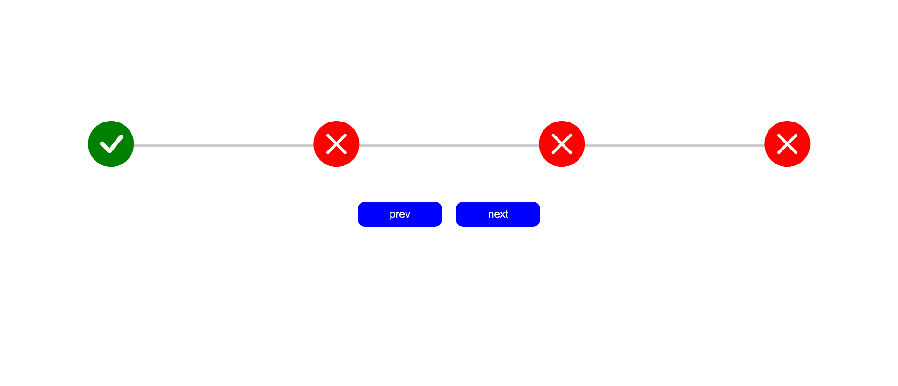

# 🔄 Step-Bar Progress Indicator

A simple and responsive **Step-Bar Progress** component built using **HTML**, **CSS**, and **JavaScript**. It visually represents multiple steps in a process with icons indicating the progress.

---

## 🚀 Features

- ✅ Visual step-by-step progress
- ✅ Smooth transition animation
- ✅ Check and cross icons to indicate completion and pending steps
- ✅ Responsive layout
- ✅ Uses Bootstrap Icons for rich visual feedback

---

## 🛠️ Technologies Used

- **HTML** – For the structure of the step bar
- **CSS** – For styling and animation effects
- **JavaScript** – For dynamic behavior (next/prev functionality)
- **Bootstrap Icons** – Icon set used in the step circles

---
## Screenshot



---

## 🧠 JavaScript Logic

- Updates the active step on "Next" or "Prev" button click.
- Visually fills the progress bar.
- Changes the icon (check/cross) based on active step.

---

## 🔗 Bootstrap Icons CDN

```html
<link rel="stylesheet" href="https://cdn.jsdelivr.net/npm/bootstrap-icons@1.10.5/font/bootstrap-icons.css">


----


## 📁 File Structure

